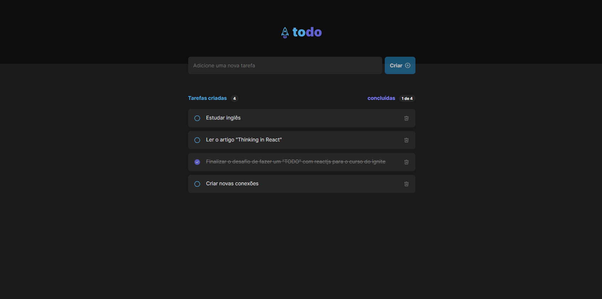

<h1 align="center">
  <a>
    Todo-ignite
  </a>
</h1>

<b>Todo-ignite</b> é um TODO com as funcionalidades de adicionar, listar, remover e marcar as tarefas como concluídas!

   

  

  

  

  

  

Primeiro desafio do ignite da trilha de reactjs concluído, onde a proposta era o desenvolvimento de um TODO com as funcionalidades de adicionar, listar, remover e marcar as tarefas como concluídas!

Um projeto muito bom para praticar os fundamentos do react... Sem dificuldades no HTML e CSS, apenas conhecendo mais sobre o react e vendo diferentes formas para chegar no resultado desejável!

